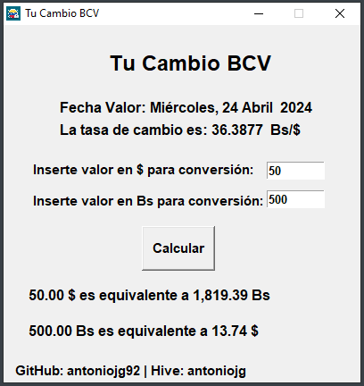

## Tu Cambio BCV

It's a desktop application to convert from dollars to bolivars and vice versa, using the rate of the central bank of Venezuela, applying web scraping.

# Instructions for Windows
- Download the 64 Bit version of [Tu Cambio BCV 64BIT.zip](https://github.com/AntonioJG92/Tu-Cambio-BCV/raw/refs/heads/main/Tu%20Cambio%20BCV%2064BIT.zip)
<!-- - Download the 32 Bit version of [Tu Cambio BCV 32BIT.zip](https://github.com/AntonioJG92/Tu-Cambio-BCV/raw/main/Tu%20Cambio%20BCV%2032BIT.zip) -->
- Unzip the file Tu Cambio BCV.zip wherever you want.
- Run the exe file.

# Source code
You can download the Python script and modify it as you wish. You can also use the program on operating systems such as Linux or Mac if you install the necessary dependencies.

# Made with ❤️
Program developed with Python, the tkinter, requests, and bs4 libraries, and Pyinstaller using AutoPyToExe.

# Support the project
If you like the program you can support its development.

  

  
